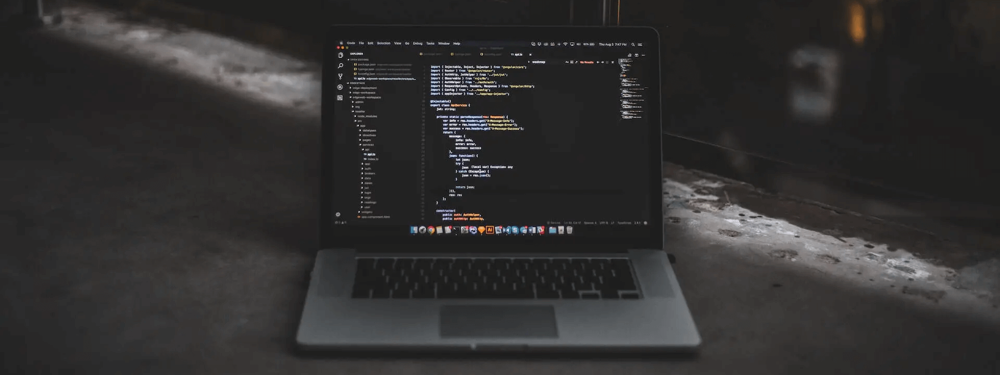

<h1 align="center">Hola 👋, Soy GERSON GARAYAR</h1>
<h3 align="center">FRONTEND DEVELOPER</h3>

- 🔭 ACTUALMENTE TRABAJO EN [PLAY VIDEOS](https://github.com/devSalas/video-platform-app)

- 🌱 ESTOY ESTUDIANDO **NEXT JS y NODE JS**

- 👨‍💻 TODOS MIS PROYECTOS ESTÁN EN [MY PORTFOLIO](gersongarayar.netlify.app)

- 📫 PUEDES CONTACTARME EN **garayargerson30@gmail.com**

<h3 align="left">Connect with me:</h3>

<!--
**GersonGarayar20/GersonGarayar20** is a ✨ _special_ ✨ repository because its `README.md` (this file) appears on your GitHub profile.

Here are some ideas to get you started:

- 🔭 I’m currently working on ...
- 🌱 I’m currently learning ...
- 👯 I’m looking to collaborate on ...
- 🤔 I’m looking for help with ...
- 💬 Ask me about ...
- 📫 How to reach me: ...
- 😄 Pronouns: ...
- ⚡ Fun fact: ...
-->
